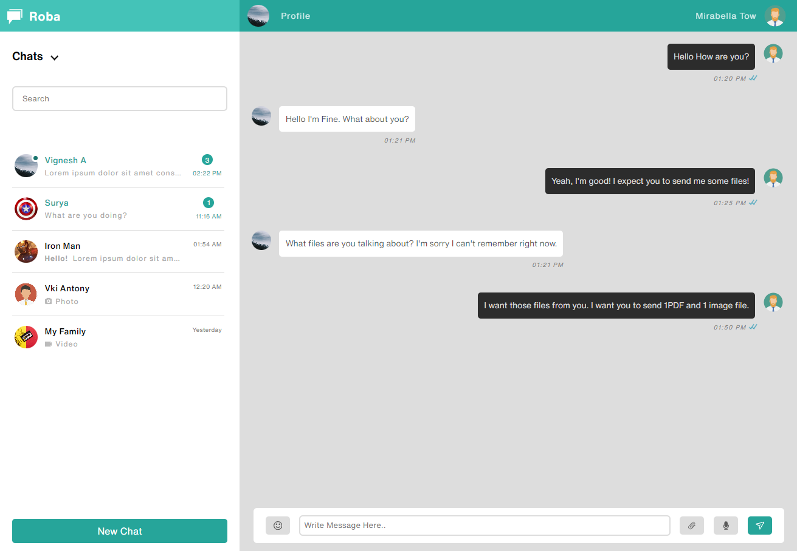
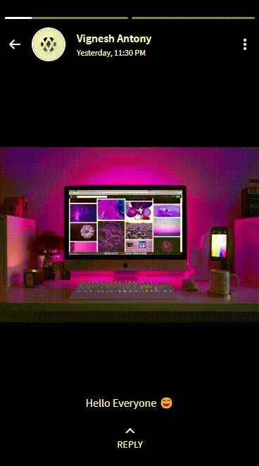
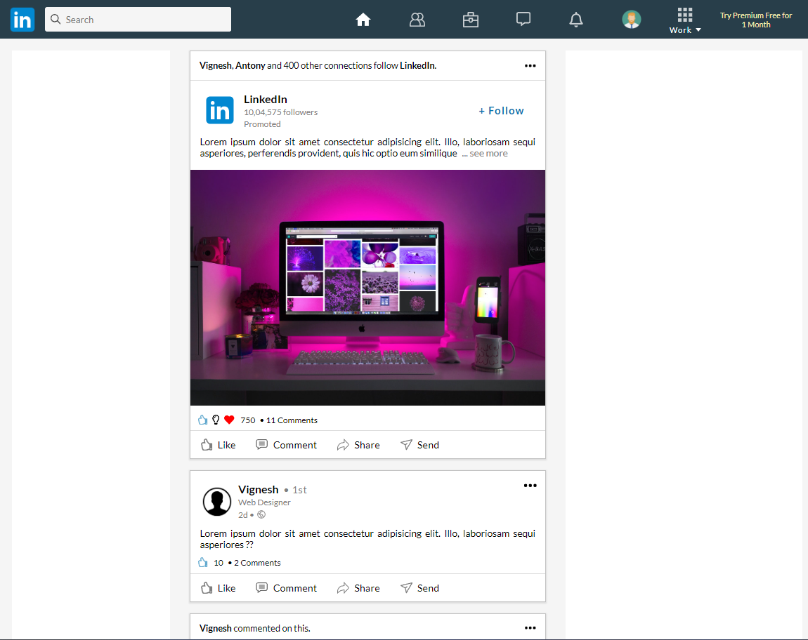
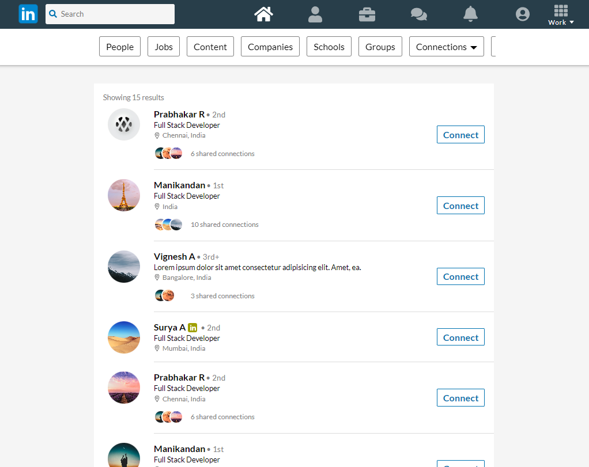
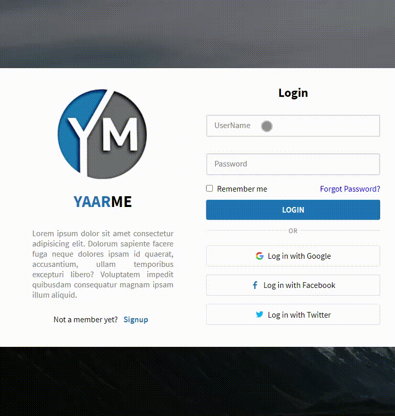
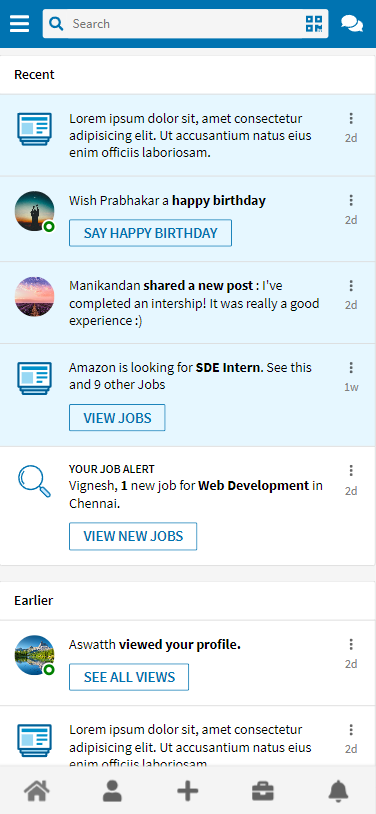
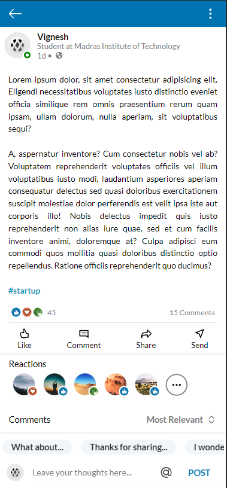
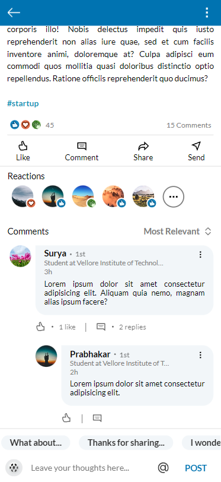
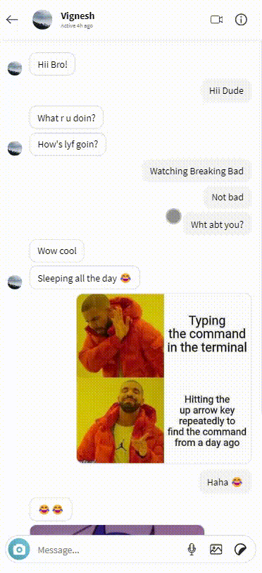

# Web Projects Portfolio

Welcome to my web development portfolio! Below, you'll find a list of projects I've worked on using HTML, CSS, and JavaScript.

## [Roba Chat Application](Messenger/index.html)

A chat application project that depicts the messaging interface. Basically, a layout for a messaging application, focusing on the visual structure.

**Features:**

-   Real-time messaging layout
-   User-friendly interface

## [WhatsApp Status Feature](StatusPage/index.html)

A cool project that emulates the status feature of WhatsApp.

**Features:**

-   Status updates with multimedia content
-   Interactive user experience
-   Mobile-friendly design

## [LinkedIn Homepage](LinkedIn-Sidebar/index.html)

A project that mimics the homepage layout of LinkedIn with a sidebar.

**Features:**

-   LinkedIn-style news feed
-   Interactive sidebar navigation
-   Responsive design

## [LinkedIn Networks Page](MyNetwork/index.html)

A project that replicates the network connections page of LinkedIn.

**Features:**

-   Visual representation of network connections
-   Clean and professional layout

## [LinkedIn Profile Page](ProfilePage/index.html)

A project that replicates the profile view and updation page of LinkedIn.

**Features:**

-   Responsive profile layout
-   LinkedIn-style design elements

## [Login and Signup Page](LoginPage/index.html)

Simple login and signup pages with a responsive design.

**Features:**

-   Secure user authentication
-   User-friendly form design
-   Mobile and desktop compatibility

## [LinkedIn Notifications Page](Notifications/index.html)

A project that recreates the notifications page of LinkedIn.

**Features:**

-   Display of various notification types
-   Clear and concise notification design
-   Responsive layout

## [LinkedIn Posts Page](PostPage/index.html)

A project that mirrors the layout of a post page on LinkedIn.

**Features:**

-   Post creation and commenting
-   Rich multimedia support
-   Social engagement features

## [Instagram Chat](Messaging/Insta/index.html)

A project that recreates the chat feature of Instagram.

**Features:**

-   Direct messaging functionality
-   Dynamic chat interface
-   Emphasis on user experience

---

### Author

Developed and maintained by [Vignesh Antonyraj](https://github.com/vignesh-antony). Thank you for checking out my web development projects! If you have any questions or suggestions, feel free to contact me.
